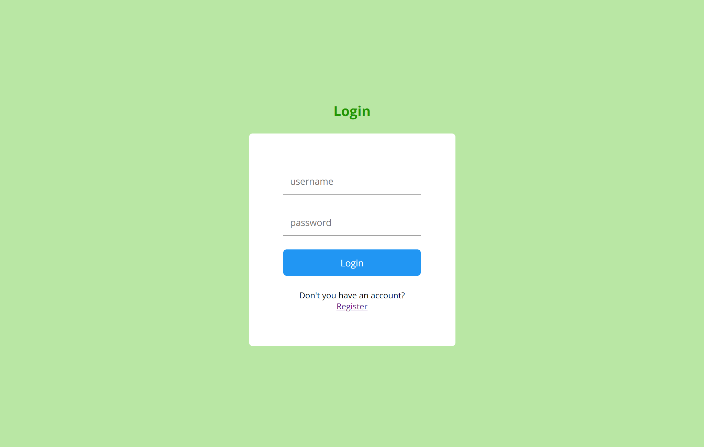
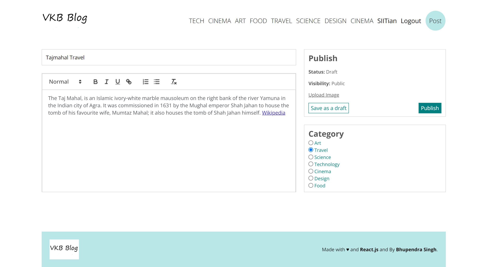
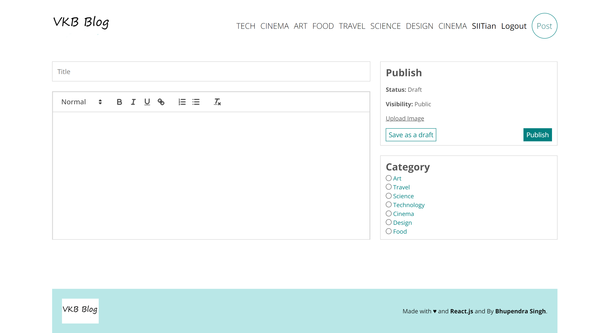
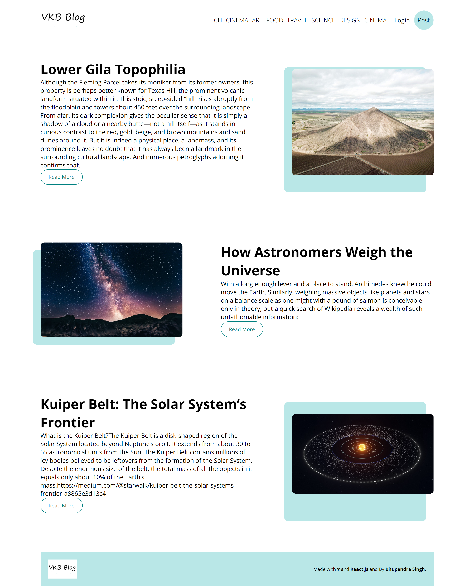
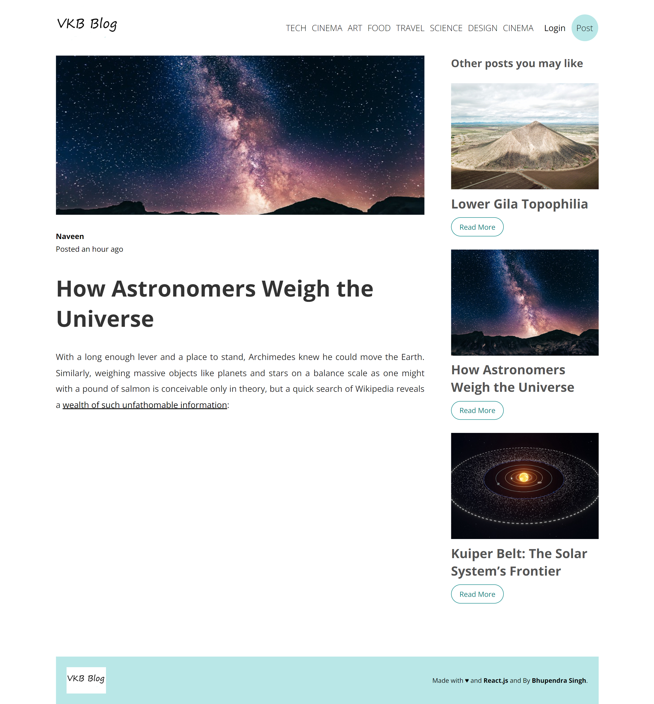
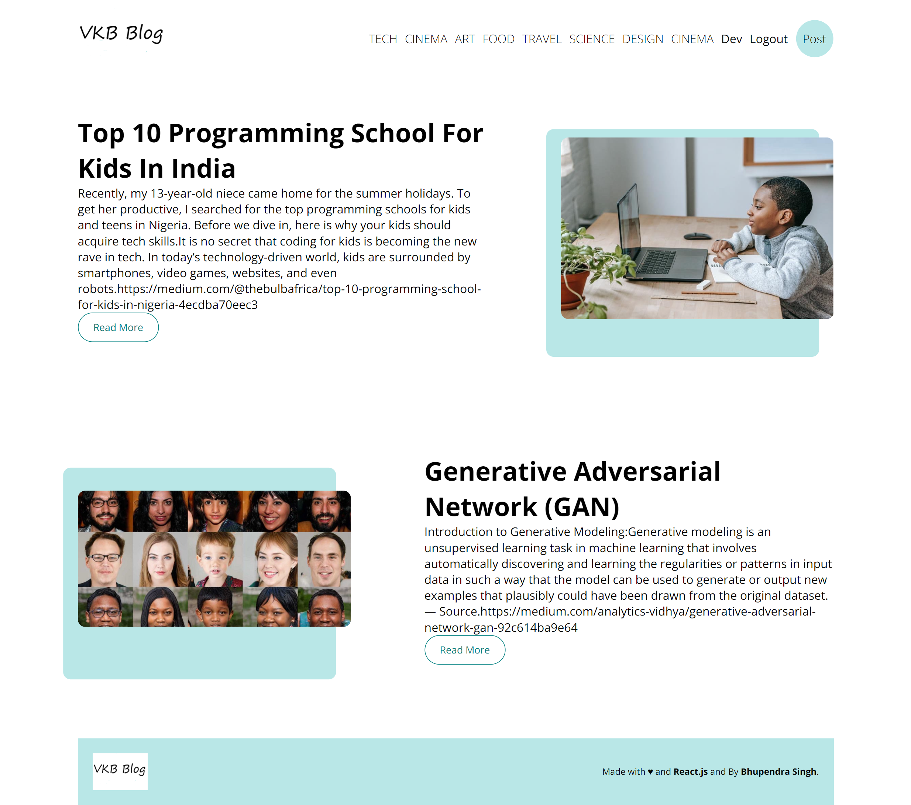
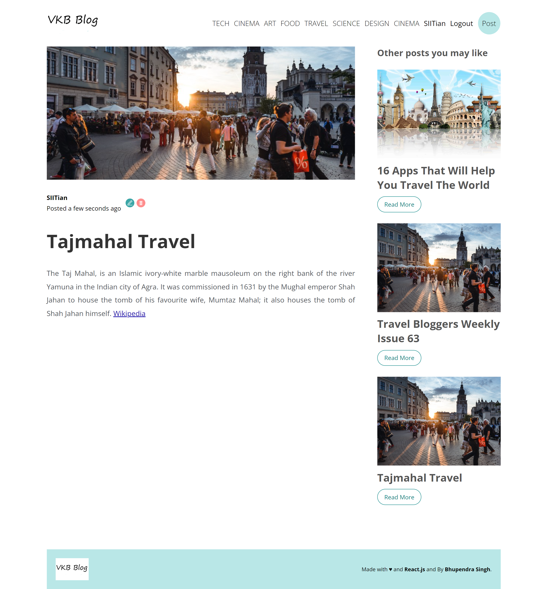
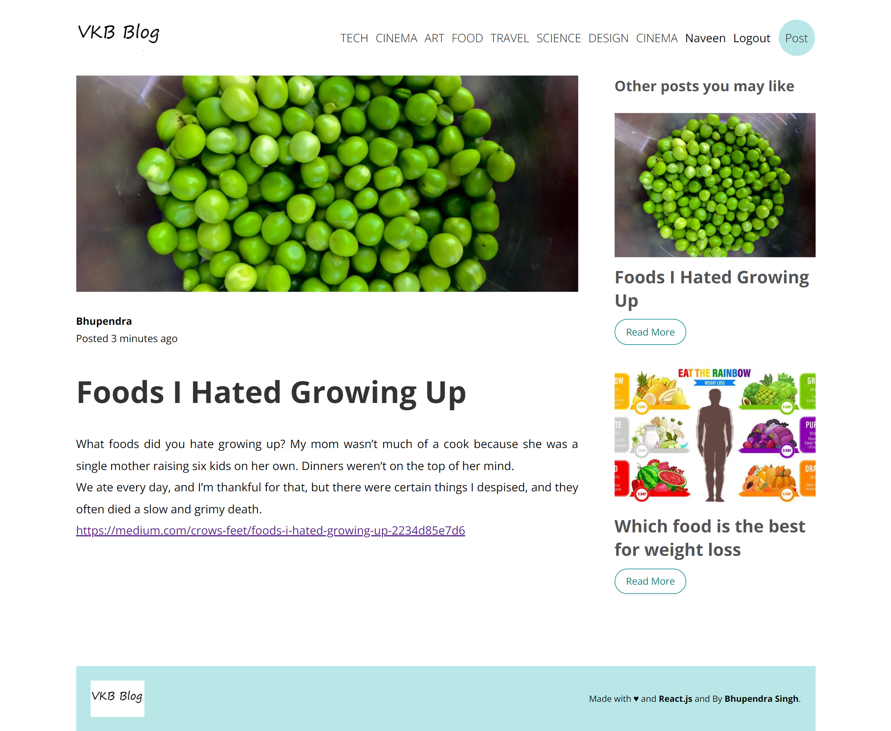
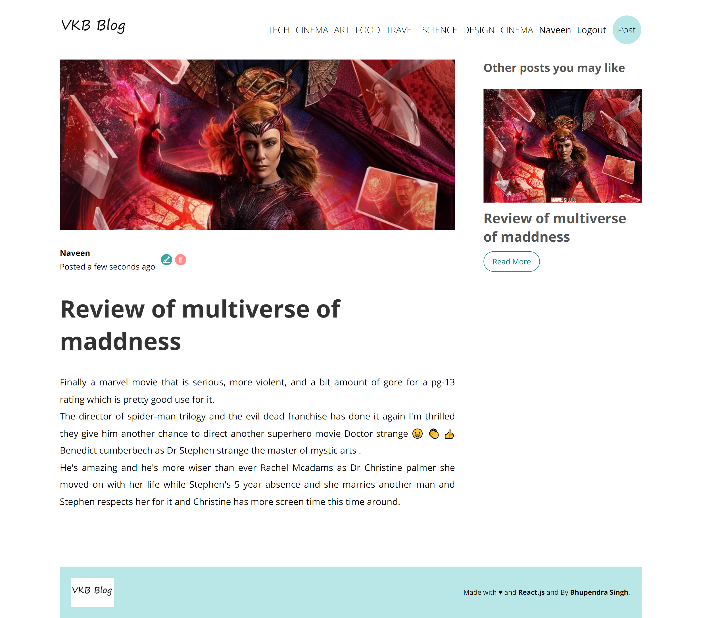

# Project Description

## Talking about Technologies
**--   Used `React.js, Html, Css and JavaScript` for `Fronted` and `Node.js, Express.js and MySql` for `Backend`.**

## Functionality of our Blog-Application
**--  We can login,register and logut.**

**--  Used JWT for authentication.**

**--  On Home page all Blogs are fetched from MySql database.**

**--  When we click on single Blog we get that Blog with blog details and writer of that post.**

**--  We can upload Image with text in our blog, every uploaded image will be store on server.**

**--  There is sidebar on single blog page which is going to recommend same type of blogs.**

**--  We can see all blog written by us and can update or delet them .**

**--  We can edit and delete our Blog, but cannot edit or delete a blog posted by other user.**

**--  We are are styling text of our blog.**

# Images of Application
## Login_Page

## Register Page

## Home page

## Edit a Post

## Create a Post

## ALL Science Post

## Single Science Post

## ALL Tech Post

## All Travel Post

## Single Travel Post

## Single Travel Post

## Single Food Post

## Single Cinema Post

 
